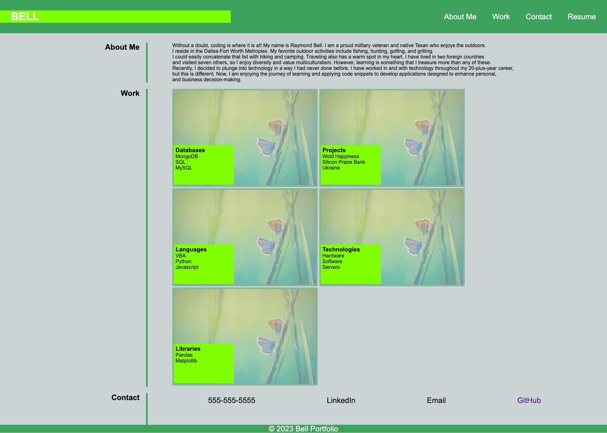

# Bell Portfolio

## Description

This project entailed creating a webpage that warehouses information about me, giving colleagues and potential employers a snap shot of my career highlights, including technology-based knowledge, skills, and abilities.

- This project was inspiring because it afforded another opportunity to exercise and showcase continued development of relevant skills.
- Tech industry employers value relevant work experience and proficiency.
- This site provides colleagues and employers internet access to my professional profile.
- E-based portfolios is the norm, especially in the tech industry.

## Table of Contents

- [Usage](#usage)
- [Credits](#credits)
- [License](#license)

## Usage

1. Go to your browser.
2. Visit the address listed below.
3. Click a link on the navigation bar to view additional information.

Web address:  

    

## Credits

https://www.markdownguide.org/cheat-sheet/

https://gist.github.com/lukas-h/2a5d00690736b4c3a7ba

https://coding-boot-camp.github.io/full-stack/github/professional-readme-guide

MIT License

Copyright (c) 2023 G6-2Flyy

Permission is hereby granted, free of charge, to any person obtaining a copy of this software and associated documentation files (the "Software"), to deal in the Software without restriction, including without limitation the rights to use, copy, modify, merge, publish, distribute, sublicense, and/or sell copies of the Software, and to permit persons to whom the Software is furnished to do so, subject to the following conditions:

The above copyright notice and this permission notice shall be included in all copies or substantial portions of the Software.

THE SOFTWARE IS PROVIDED "AS IS", WITHOUT WARRANTY OF ANY KIND, EXPRESS OR IMPLIED, INCLUDING BUT NOT LIMITED TO THE WARRANTIES OF MERCHANTABILITY, FITNESS FOR A PARTICULAR PURPOSE AND NONINFRINGEMENT. IN NO EVENT SHALL THE AUTHORS OR COPYRIGHT HOLDERS BE LIABLE FOR ANY CLAIM, DAMAGES OR OTHER LIABILITY, WHETHER IN AN ACTION OF CONTRACT, TORT OR OTHERWISE, ARISING FROM, OUT OF OR IN CONNECTION WITH THE SOFTWARE OR THE USE OR OTHER DEALINGS IN THE SOFTWARE.

## Features

- Page title
- URL/ Web address
- Internal/External links
- Digital Profile
- Bio (placeholder)
- Images (placeholder)
- Contacts

